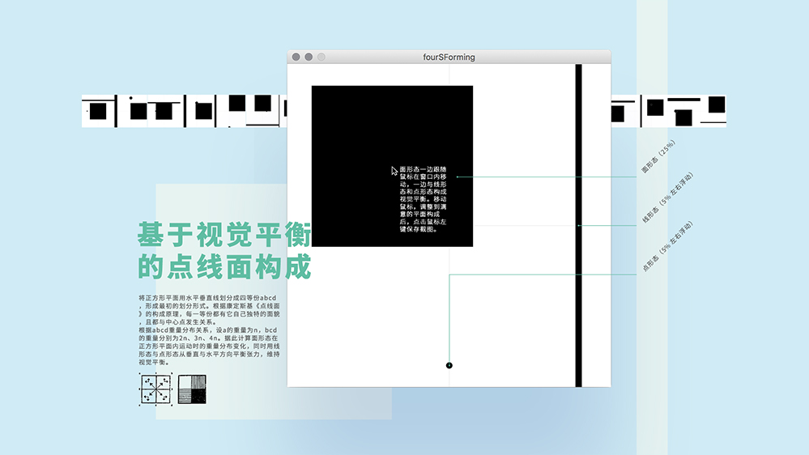

# Application for point-line-surface composition

A application for point-line-surface composition based on visual balance.

## Using instruction

- There are three elements on the interface: point line and surface.
- Point, line and surface are indicated in black.
- Point, line and surface form a balanced relationship on the panel.
- Move the mouse to adjust the position of the surface, and the point and line will move to the new balance position.

## Techstacks

- Processing

Hope you enjoy this application 🤩
